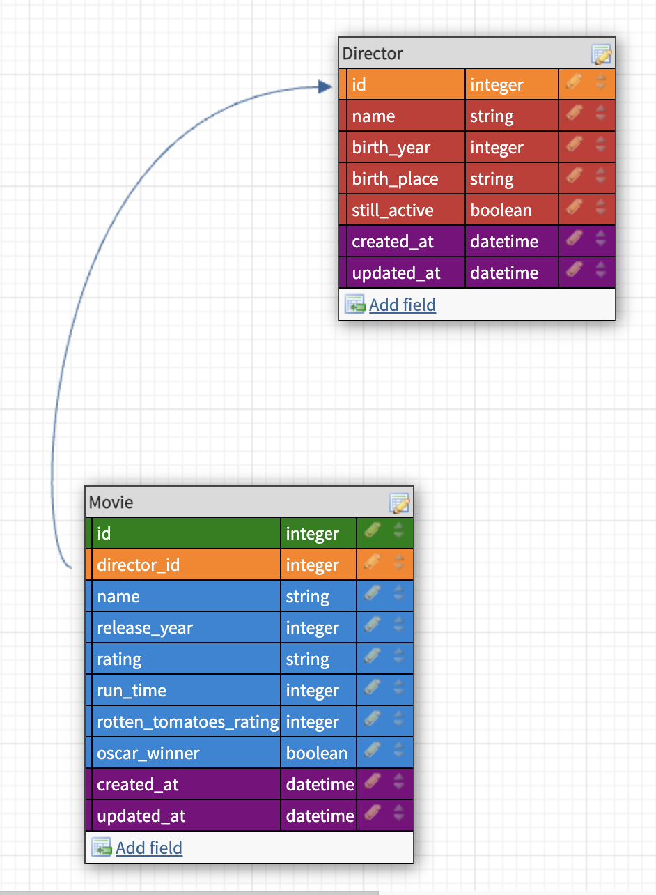

# README

TO DO:
- update sort alphabetically to have a button instead of a automatically sorting alphabetically
- use query params for search methods
- update to query params for all sort methods as well
- refactor to move all methods to models

